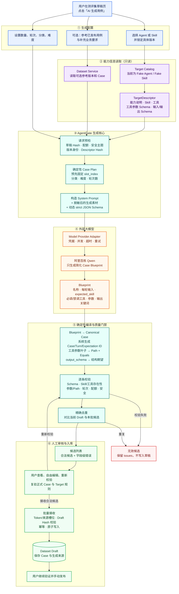

# 测评集自动生成原理图（当前实现）

> 当前代码分支：`codex/dataset-auto-generation`
> 当前 Recipe：`dataset-case-generation/v14`

## 一句话理解

**Target 提供能力边界，模型设计业务场景，后端把场景编译成可执行、可机器判定的 Case，用户审核后才进入测评集草稿。**

## 当前边界

- 模型不会直接生成完整领域 Case，也不负责生成 ID、Condition 和 Path。
- 候选不会自动入库、自动发布或自动启动评测。
- 单条候选失败不会影响同批其他合法候选。
- 当前 Target Catalog 使用 Fake Agent/Skill；真实平台后续只需实现相同的只读 `TargetDescriptor` 适配接口。
